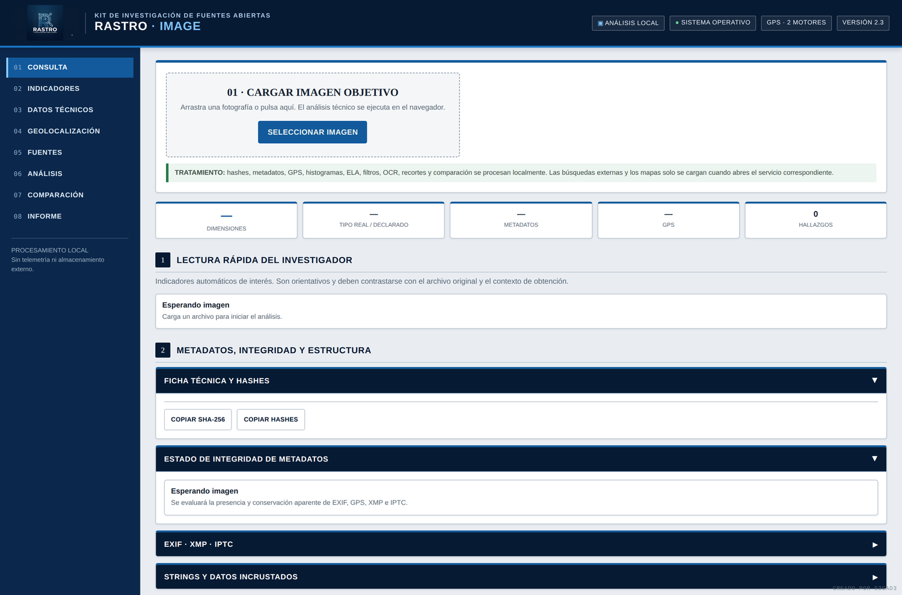
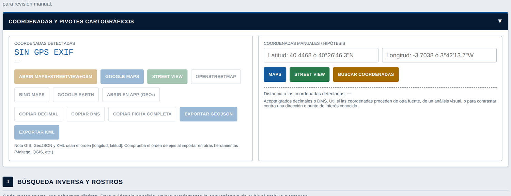

# 🛰️ RASTRO · IMAGE

**Módulo de análisis OSINT de imágenes del kit de investigación RASTRO**

**[▶ Probar la herramienta](https://s3gad3.github.io/rastro-image)**

## Qué es

**RASTRO · IMAGE** es el módulo de análisis de imágenes del **kit de investigación RASTRO**, pensado para investigadores de cibercrimen, analistas OSINT y equipos de verificación de contenido. Es un **único archivo HTML** que se ejecuta entero en el navegador: sin backend, sin API key, sin subida de la imagen a ningún sitio salvo que el propio investigador abra explícitamente un motor externo (Google Lens, PimEyes, Google Maps...).

Carga una fotografía y obtén en segundos:

- 🧬 Huellas de integridad — SHA-256, SHA-1, MD5, aHash, dHash
- 🗂️ Metadatos EXIF / XMP / IPTC, con evaluación automática de su integridad
- 📍 Geolocalización GPS **verificada por dos motores de lectura independientes**
- 🔍 Pivotes de búsqueda inversa — Google Lens, Bing, Yandex, TinEye, PimEyes
- 🧪 Image Intelligence — ELA, filtros, paleta e histograma RGB
- ✂️ Recortes de investigación y detección de rostros (según soporte del navegador)
- 🔤 OCR y detección de QR / códigos de barras
- 🪞 Comparador de dos imágenes — hash perceptual, diferencia de píxeles, superposición
- 📄 Informe automático para el expediente, exportable en TXT y JSON

## 📍 El módulo de geolocalización

Es la parte a la que más cuidado se ha dedicado, porque en un caso real un dato de ubicación mal interpretado pesa mucho:

| Capacidad | Detalle |
|---|---|
| **Verificación cruzada** | Lee el GPS con `exifr` y `ExifReader` de forma independiente. Si ambos coinciden → `CONFIRMADO 2 MOTORES`; si difieren más de ~25 m → aviso de discrepancia para revisar a mano. |
| **Detección de "GPS vacío"** | Distingue un archivo *sin* bloque GPS de uno donde el contenedor **reserva el campo pero sin coordenadas** (patrón típico de Android/Pixel con la ubicación desactivada). Son hallazgos forenses distintos. |
| **Campos extraídos** | Latitud/longitud, altitud (+ referencia), rumbo de la cámara, velocidad, método de posicionamiento, satélites, DOP/error horizontal, fecha y hora GPS en UTC. |
| **Formatos** | Grados decimales y DMS (°′″) en paralelo; entrada manual acepta ambos formatos. |
| **Alertas automáticas** | Coordenadas en `(0,0)` ("Null Island"), precisión declarada baja, desfase entre fecha EXIF y fecha GPS. |
| **Pivotes** | Google Maps, Street View, OpenStreetMap, Bing Maps, Google Earth, enlace `geo:` para apps nativas. |
| **Exportación** | GeoJSON y KML del punto, con aviso sobre el orden de ejes `[lon, lat]` para evitar el error clásico al importar en QGIS/Maltego. |
| **Distancia** | Calculadora Haversine entre el punto detectado y una coordenada manual (útil para contrastar contra una dirección conocida). |

## 🚀 Uso

Sin instalación ni build:

1. Abre **[s3gad3.github.io/rastro-image](https://s3gad3.github.io/rastro-image)**, o descarga el HTML y ábrelo directamente en el navegador.
2. Arrastra o selecciona una imagen.
3. Revisa hallazgos, geolocalización, metadatos y ejecuta los módulos que necesites (OCR, comparación, códigos...).
4. Exporta el informe (TXT) o el expediente completo (JSON) al terminar.

> **Requisito de red:** el análisis es local, pero la página carga `exifr`, `exifreader` y `spark-md5` desde CDN, y `tesseract.js` bajo demanda si usas OCR. En redes institucionales con proxy restrictivo esto puede bloquear la lectura de metadatos — para uso air-gapped, aloja esas librerías localmente y ajusta las rutas en el `<head>`.

## 🧠 Cómo lee los metadatos

RASTRO · IMAGE no confía en un único parser:

1. **`exifr`** — parser principal (EXIF, XMP, IPTC, ICC) + lector GPS dedicado.
2. **`ExifReader`** — motor independiente de verificación cruzada, y el que permite detectar el patrón de "GPS vacío".
3. **Reconstrucción manual** — respaldo final por si algún contenedor expone el GPS con una disposición de tags atípica.

Todo el cálculo de GPS e integridad se resuelve una sola vez por imagen cargada y se reutiliza en pantalla, en el informe y en el expediente JSON.

## 🔒 Privacidad

Hashes, metadatos, GPS, ELA, filtros, OCR, recortes y comparación se procesan enteramente en el navegador de quien usa la herramienta. Ninguna imagen se envía a ningún sitio salvo que el investigador, explícitamente, abra un servicio externo. No hay telemetría ni almacenamiento persistente propio.

## ⚖️ Limitaciones — léelas antes de usarlo en un caso real

- **La "confirmación por 2 motores" no es verificación independiente de la realidad**: ambos motores leen los mismos bytes EXIF del mismo archivo. Si el GPS fue falsificado deliberadamente, ambos "confirmarán" el mismo dato falso — la coincidencia refuerza la fiabilidad de la *lectura*, no la veracidad del *dato*.
- **ELA** pierde fiabilidad en fotografías HDR/multi-frame (muy común en móviles actuales) y puede producir patrones llamativos sin que haya manipulación. Es un indicador orientativo, no una prueba autónoma.
- **Detección de rostros y de códigos** dependen de APIs nativas del navegador (`FaceDetector`, `BarcodeDetector`) con soporte irregular — en Firefox o Safari probablemente no estén disponibles.
- No es una herramienta de cadena de custodia certificada: es apoyo al **triage OSINT**, no un sustituto de software forense pericial cuando el caso lo requiera.
- Herramientas como **PimEyes** tienen términos de uso propios; documenta base jurídica, finalidad y tratamiento antes de usarlas en un caso real.

## 🗺️ Ideas para el futuro

- [ ] Empaquetado local opcional de las librerías CDN para uso air-gapped
- [ ] Alternativa JS a `FaceDetector`/`BarcodeDetector` para navegadores sin soporte nativo
- [ ] Indicadores adicionales de manipulación (doble compresión JPEG)
- [ ] Modo lote para varias imágenes del mismo caso

Issues y *pull requests* bienvenidos, especialmente sobre el módulo de geolocalización.

## 📄 Licencia

[MIT](./LICENSE) — usa, modifica y distribuye libremente, citando el origen.

---

Parte del **kit de investigación RASTRO** · creado por [s3gad3](https://github.com/s3gad3)

*RASTRO · IMAGE es una herramienta de apoyo al análisis. Los resultados automáticos requieren siempre valoración humana y contextual.*

